# SENG-384

# HEALTH AI – Co-Creation & Innovation Platform

A collaborative web platform that connects engineers and healthcare professionals to develop innovative health-tech solutions through structured matchmaking, secure communication, and meeting workflows.

---

## 📌 Project Overview

HEALTH AI is a role-based collaboration platform developed for the **SENG384 – Software Project IV** course.

The platform enables:

- Engineers to publish technical or AI-driven healthcare ideas
- Healthcare professionals to share clinical problems and innovation needs
- Secure collaboration initiation through meeting requests and NDA acceptance
- Admins to manage users, posts, and audit logs

The system focuses on:

- secure first-contact initiation,
- structured collaboration,
- role-based access control,
- and GDPR-aware data handling.

---

# 🌐 Live Demo

Deployed Application:  
https://seng-384.vercel.app

---

## 👥 Team Members

- Eylül Turunç
- Beril Aşçi
- Serra Selci
- Dilan Yardım

---

# 🏗️ Project Structure

```bash
SENG-384/
│
├── backend/              # Express.js backend API
├── frontend/             # React frontend application
│   ├── public/
│   ├── src/
│   ├── package.json
│   └── .env
│
├── db/                   # Database-related files/scripts
├── docker-compose.yml
├── README.md
├── SRS_HealthAI.docx.pdf
├── SDD_HealthAI.pdf
└── vercel.json
```

---

# ⚙️ Technologies Used

## Frontend

- React.js
- Tailwind CSS
- Axios
- React Router

## Backend

- Node.js
- Express.js
- JWT Authentication
- Socket.io

## Database

- PostgreSQL / MySQL

## Security

- bcrypt password hashing
- JWT-based session management
- Role-Based Access Control (RBAC)
- HTTPS communication support

## DevOps & Deployment

- Docker
- Vercel
- GitHub

---

# ✨ Main Features

## 🔐 Authentication & Authorization

- Institutional `.edu` / `.edu.tr` email restriction
- Email verification system
- Secure login/logout
- JWT authentication
- RBAC (Engineer / Healthcare Professional / Admin)

---

## 📝 Post Management

Users can:

- Create collaboration posts
- Edit or archive posts
- Save drafts
- Define:
  - required expertise
  - collaboration type
  - project stage
  - commitment level
  - confidentiality level
  - city/country

Post lifecycle states:

- Draft
- Active
- Meeting Scheduled
- Partner Found
- Expired

---

## 🔎 Search & Matching

- Filter posts by:
  - expertise
  - domain
  - location
  - project stage
  - status
- Match explanation system
- Same-city highlighting

---

## 🤝 Meeting Request Workflow

- Interest messaging
- NDA acceptance
- Meeting scheduling
- Multiple time-slot proposals
- External meeting integrations (Zoom / Teams / Meet)

---

## 🛡️ Admin Dashboard

Admins can:

- manage users,
- suspend accounts,
- remove inappropriate posts,
- monitor logs,
- export CSV reports,
- track platform activity.

---

# 🔒 Security & Privacy

The system follows GDPR-aware design principles:

- No patient data storage
- No file upload support
- Encrypted passwords using bcrypt
- Secure session handling
- Audit logging
- HTTPS communication
- Tamper-resistant logs

---

# 🚀 Installation & Setup

## 1. Clone the Repository

```bash
git clone <repository-url>
cd SENG-384
```

---

## 2. Backend Setup

```bash
cd backend
npm install
```

Create a `.env` file:

```env
PORT=5000
DATABASE_URL=your_database_url
JWT_SECRET=your_jwt_secret
EMAIL_USER=your_email
EMAIL_PASS=your_password
```

Run backend:

```bash
npm run dev
```

---

## 3. Frontend Setup

```bash
cd frontend
npm install
npm run dev
```

Frontend runs on:

```bash
http://localhost:5173
```

---

## 4. Docker Setup (Optional)

Run the entire project with Docker:

```bash
docker-compose up --build
```

---

# 📡 API Endpoints

## Authentication

| Method | Endpoint                 | Description       |
| ------ | ------------------------ | ----------------- |
| POST   | `/api/auth/register`     | Register new user |
| POST   | `/api/auth/login`        | Login             |
| POST   | `/api/auth/verify-email` | Verify email      |
| POST   | `/api/auth/logout`       | Logout            |

---

## Posts

| Method | Endpoint                |
| ------ | ----------------------- |
| GET    | `/api/posts`            |
| POST   | `/api/posts`            |
| GET    | `/api/posts/:id`        |
| PUT    | `/api/posts/:id`        |
| PATCH  | `/api/posts/:id/status` |

---

## Meetings

| Method | Endpoint            |
| ------ | ------------------- |
| POST   | `/api/meetings`     |
| PATCH  | `/api/meetings/:id` |
| DELETE | `/api/meetings/:id` |

---

## Admin

| Method | Endpoint               |
| ------ | ---------------------- |
| GET    | `/api/admin/users`     |
| PATCH  | `/api/admin/users/:id` |
| DELETE | `/api/admin/posts/:id` |
| GET    | `/api/admin/logs`      |

---

# 📱 UI Screens

The platform includes:

- Login / Register : 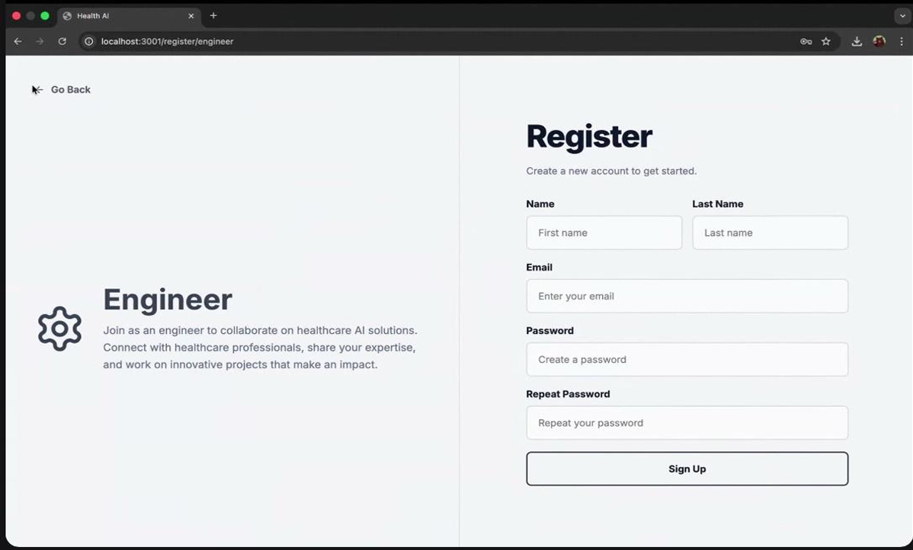 / 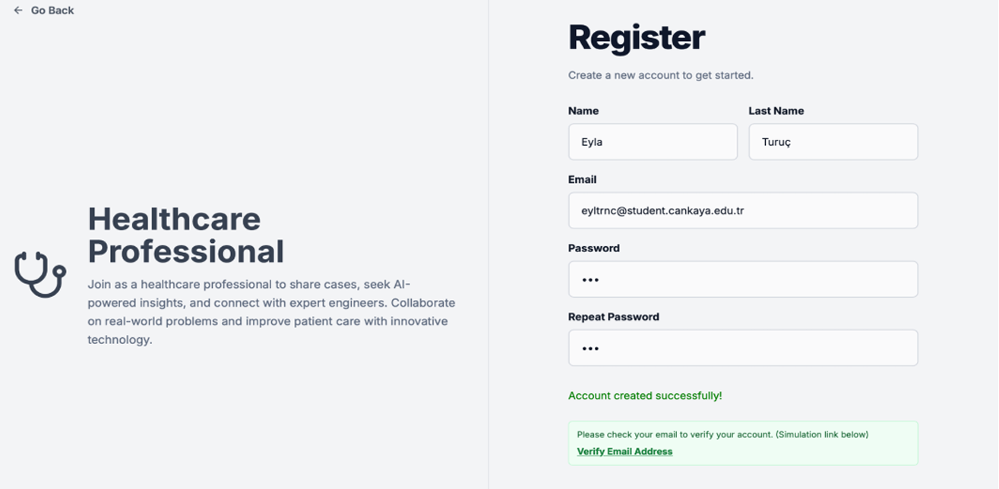 / 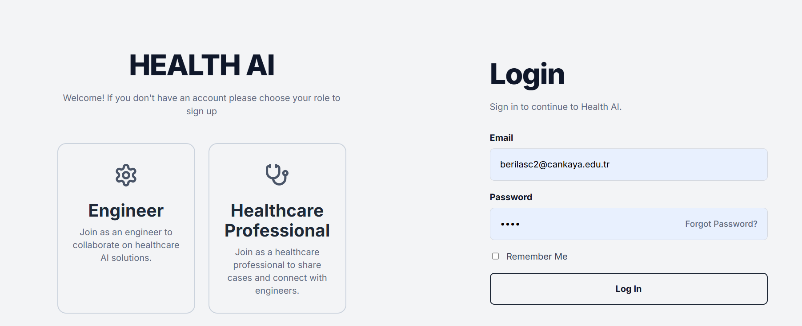
- Dashboard : 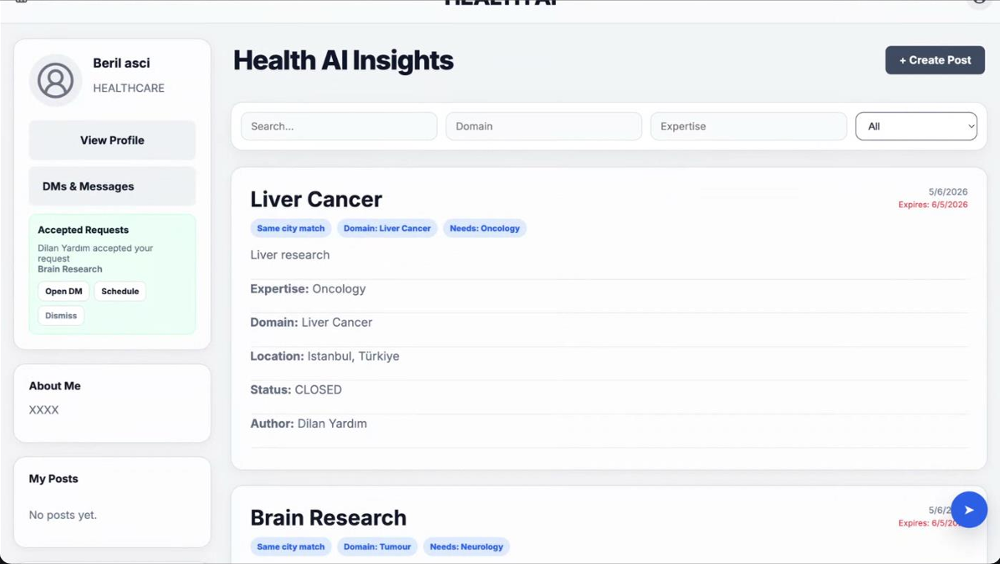
- Profile Page : 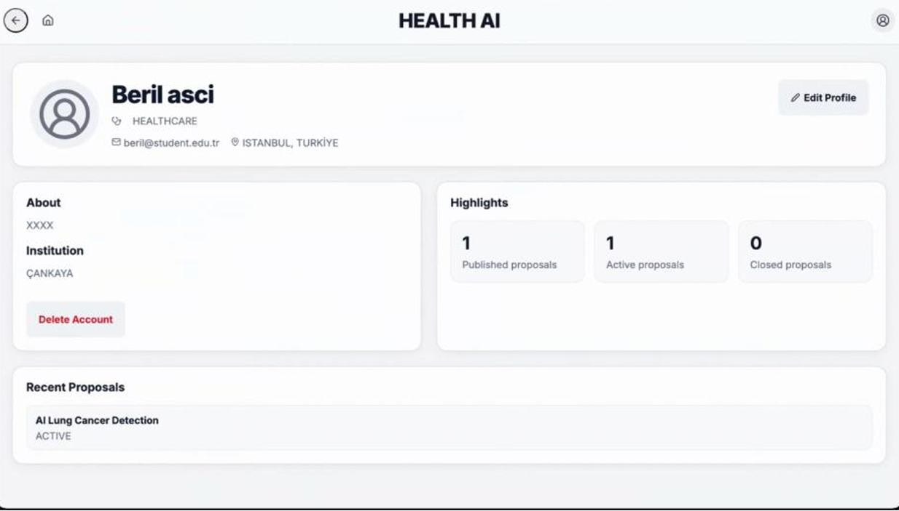
- Delete account: 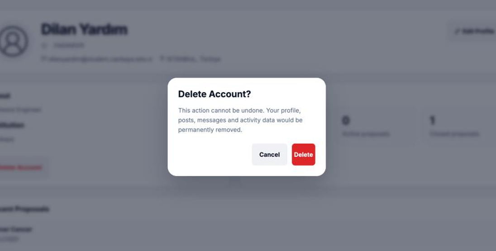
- Meeting Request Screen : 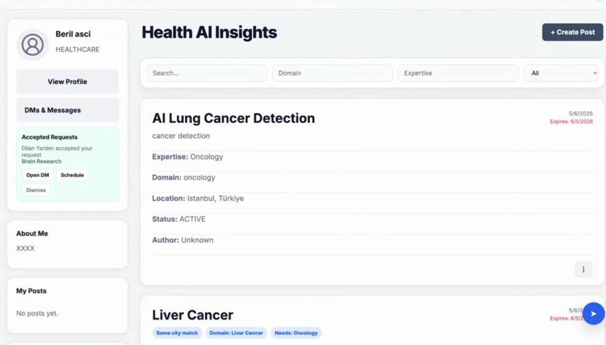
- Schedule meeting: 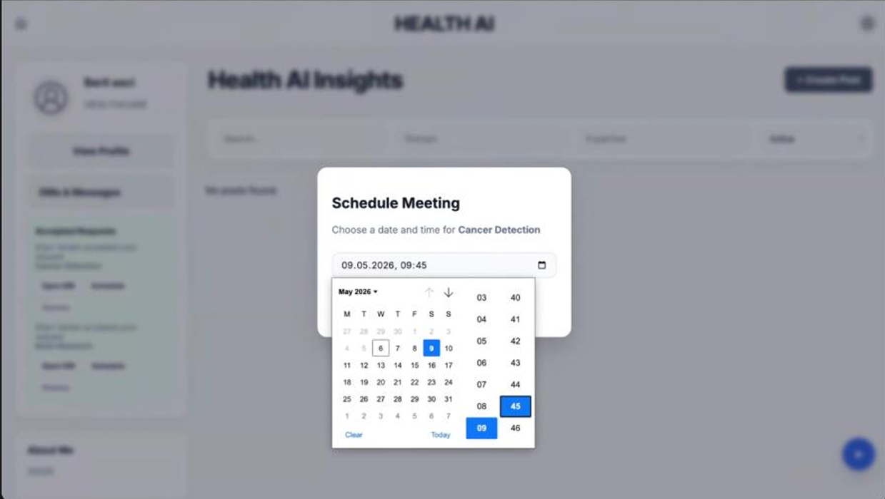
- Create Post: 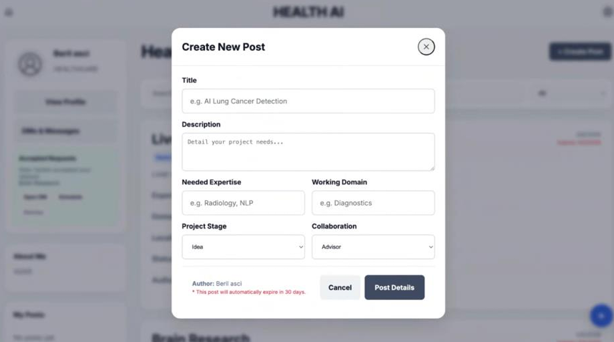
- Messaging Interface: 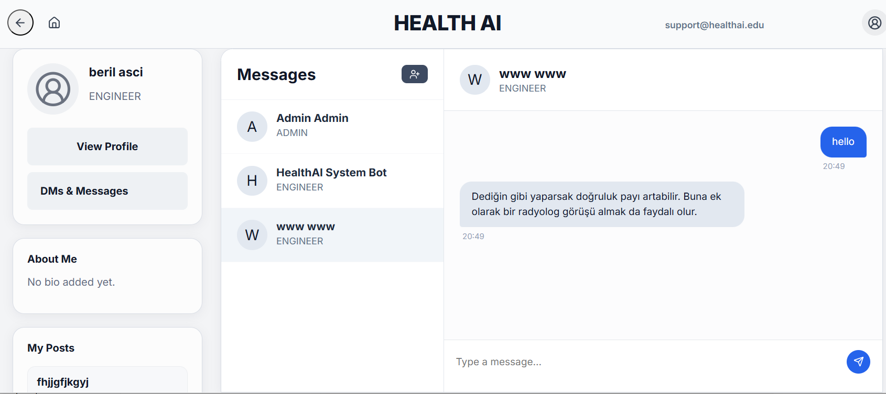
- Admin Panel : 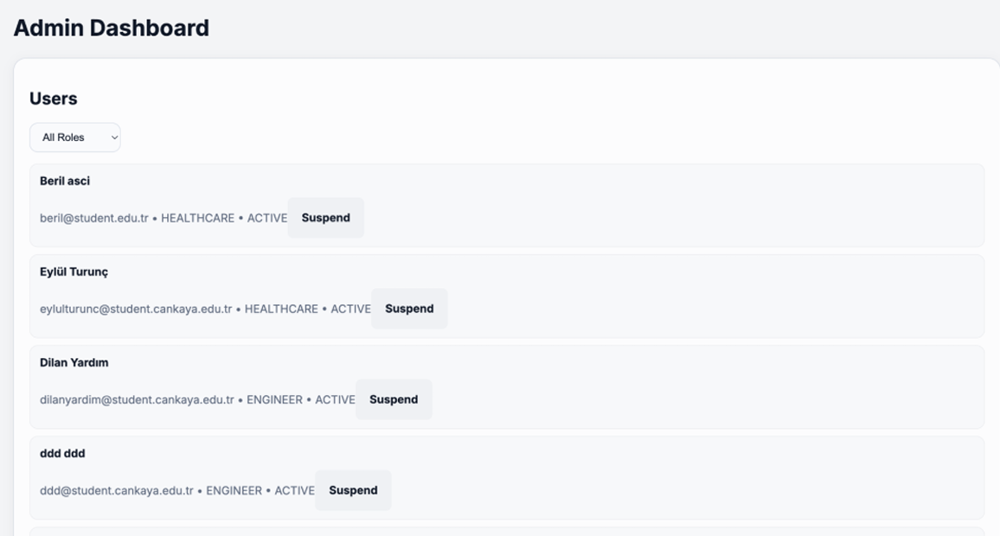

---

# 📊 Non-Functional Requirements

- Search results under **1.5 seconds**
- Page load under **3 seconds**
- Support for **1000 concurrent users**
- Mobile responsive UI
- WCAG 2.1 accessibility compliance

---

# 📄 Documentation

- `SRS_HealthAI.docx.pdf`
- `SDD_HealthAI.pdf`
- `UserGuide_HealthAI.pdf`

These documents contain:

- software requirements,
- architecture diagrams,
- ER diagrams,
- API designs,
- state diagrams,
- and UI wireframes.

---

# 📌 Future Improvements

Potential future enhancements:

- AI-powered recommendation engine
- Smart partner matching
- Real-time notifications
- Calendar integrations
- Advanced analytics dashboard
- In-platform video meetings

---

# 📜 License

This project was developed for academic purposes as part of the  
**SENG384 – Software Project IV** course.
